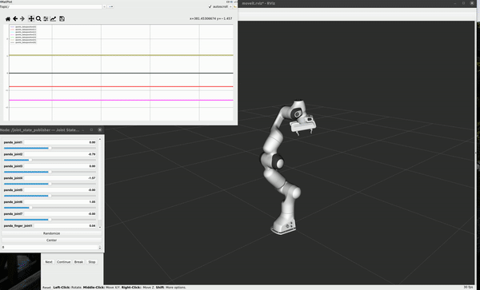

# RobotArmOutput

## Requirements

- ROS noetic
- [MoveIt](https://ros-planning.github.io/moveit_tutorials/doc/getting_started/getting_started.html) 

## Pipeline

Total task involves two arms but train them one by one: 


## Data Collection

Collecting data from both end during performing 5 task with different angle: 

1. from home to reach the object at  degree of 0, 45, 90, 135, 180 (CCW) with radius of 0.3m

2. pick the object straight up

3. move the object radially away with radius of 0.55m

4. back to home position

   

note: not including gripper operation yet, only 7 degree joint state kinematics.

**For Human end - record EMG and IMU topic 4 Myo devices (2 for each arm) from human:**

[Procedure details](https://github.com/jameszhz1647/connect_myo/tree/input_data)

**For Robot end - used ROS MoveIt to plan a motion by setting target end-effector for Franka robot arm, recorded the topics of joint positions and velocities:**

## ROS Nodes

- `task.py` plans and executes one task including 4 segments using `move_group`, publishes the `joint_state` topic all the time.
- `talker.py` subscribe the `joint_state` topic, publish the `points_data` topic that needed to be collected, provides a service to set the switch of publisher for `points_data` topic.

## Instructions

1. Launch demo file in **custom_ws**: provide basics for panda MoveIt 

   ```jsx
   roslaunch panda_moveit_config demo.launch use_gui:=true
   ```

2. Launch talker node: listen to and publish the desired topics and provide set_pub service (used for record purpose, embedded in set_target service)

3. Launch task node: provide services: set_home, set_target  (2-3 in the same launch file)

   ```jsx
   roslaunch move_group_pkg robot_output_end.launch 
   ```

4. Run rosbag to record desired topic (topic only publishes during performing task), including **position** for each trajectory points. (trajectory size varies)

   ```jsx
   rosbag record /points_data
   ```

5. Call service to execute one task

   ```jsx
   rosservice call /execute 
   ```

6. Task contains 4 segments described above, so each segment is paused and will need to click “Enter” to continues next segment. The prompt will show in the terminal as well.

7. convert rosbag to csv [(instruction details)](https://github.com/AtsushiSakai/rosbag_to_csv)

   `	rosrun rosbag_to_csv rosbag_to_csv.py` (make sure roscore running)


7. need post process robot data

   normalize by points size or human execution time ? (pos/velocity/acc) 
