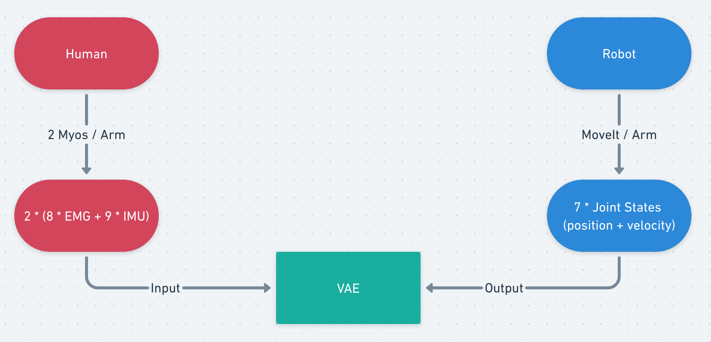

# RobotArmOutput

### Pipeline

Total task involves two arms but train them one by one: 



### Data Collection

Collecting data from both end during performing same reaching tasks: 

**For input end - record EMG and IMU topic 4 Myo devices (2 for each arm) from human:**

Procedure describes in https://github.com/jameszhz1647/connect_myo/tree/input_data

**For output end - used ROS MoveIt to plan a motion by setting target end-effector for Franka robot arm, recorded the topics of joint positions and velocities:**

1. Launch demo file in **custom_ws**: provide basics for panda MoveIt 

   ```jsx
   roslaunch panda_moveit_config demo.launch use_gui:=true
   ```

2. Launch talker node: listen to and publish the desired topics and provide set_pub service (used for record purpose, embedded in set_target service)

3. Launch task node: provide services: set_home, set_target  (2-3 in the same launch file)

   ```jsx
   roslaunch move_group_pkg robot_output_end.launch 
   ```

4. Run rosbag to record desired topic (topic only publishes during performing task)

   ```jsx
   rosbag record /joints_data/position 
   ```

5. Call service to perform task

   ```jsx
   rosservice call /set_home   //set home position  
   rosparam set x_y_pos    // set x, y coordinates of target position
   rosservice call /set_target   //set home position   
   ```

6. convert rosbag to csv

​	instruction detail: https://github.com/AtsushiSakai/rosbag_to_csv

​	`	rosrun rosbag_to_csv rosbag_to_csv.py` (make sure roscore running)


### Variational Autoencoder


